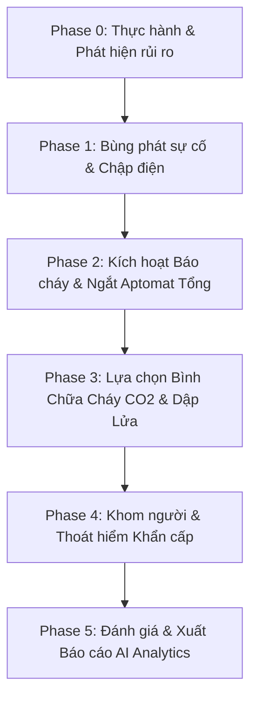

# KỊCH BẢN CHI TIẾT GAME VR: THOÁT HIỂM & PCCC PHÒNG LAB MÁY TÍNH
**Dự án:** Hệ thống VR Huấn luyện & Diễn tập An toàn PCCC Tích hợp AI Mentor  
**Bối cảnh:** Phòng Máy tính / Server Trường Đại học (Computer & Server Lab)  
**Thiết bị target:** Meta Quest Standalone (Interaction 6DOF)  

---

## 1. HỒ SƠ NHÂN VẬT & NPC (CHARACTERS)

### 👤 Nhân vật chính (Người chơi / Sinh viên VR)
* **Vai trò:** Sinh viên năm cuối ngành Kỹ thuật Máy tính đang thực hành thiết lập cụm Server trong phòng Lab.
* **Trạng thái ban đầu:** Đeo kính VR, hai tay cầm Controller 6DOF. Sinh viên đứng trước bàn thực hành với hệ thống máy tính và tủ Server mini.
* **Chỉ số sinh tồn (HUD / Đồng hồ sinh học trên cổ tay VR):**
  * **Thanh Oxy / Nhịp thở (Oxygen Level):** 100% (Giảm dần nếu hít phải khói độc do không khom người).
  * **Thanh Thể lực / Sức khỏe (Health):** 100% (Giảm nếu bị bỏng, giật điện hoặc ngạt khí).
  * **Trạng thái Khom người (Crouch Status):** Đạt/Không đạt (Kiểm tra độ cao Headset so với mặt sàn: `< 1.2m` là an toàn dưới lớp khói).

### 👥 Các NPC xung quanh (Non-Player Characters)
1. **NPC Nam (Minh) - Bạn cùng nhóm:**
   * *Hành vi:* Đang ngồi gõ code bên bàn đối diện. Khi sự cố xảy ra, Minh hoảng loạn, làm đổ ghế đứng dậy hô to: *"Cháy rồi! Khói nhiều quá, làm sao bây giờ?!"* và chạy hỗn loạn về phía cửa.
2. **NPC Nữ (Hoa) - Sinh viên thực hành:**
   * *Hành vi:* Đang cắm thiết bị thử nghiệm. Khi tụ điện nổ, Hoa bị giật mình, cố hít thở và bị ngất xỉu nhẹ ở góc phòng do hít khói độc (Tình huống phụ cho người chơi lựa chọn cứu trợ).
3. **Trợ lý AI Mentor (Virtual Voice & HUD Avatar):**
   * *Hành vi:* Trợ lý ảo AI hiển thị dạng Robot/Drone nhỏ bay nhẹ theo người chơi hoặc qua chiếc đồng hồ đeo tay. Phát giọng nói cảnh báo, hướng dẫn hoặc phản hồi hành vi của người chơi thời gian thực.

---

## 2. KHUNG CẢNH & VỊ TRÍ VẬT DỤNG (ENVIRONMENT & ITEM MAP)

### 🏫 Khung cảnh xung quanh (Atmosphere & Visuals)
* **Môi trường:** Phòng Lab rộng khoảng 60m², gồm 4 dãy bàn máy tính, 2 tủ Server chính đặt ở góc phòng, 1 bảng trắng giảng dạy, cửa chính ở phía Nam, cửa sổ chớp ở phía Bắc.
* **Ánh sáng & Âm thanh khi xảy ra sự cố:**
  * Đèn trần nhấp nháy liên tục do sụt áp điện.
  * Tiếng còi báo cháy trường học reo rú vang dội (`Beep-Beep-Beep`).
  * Khói đen và xám bắt đầu tích tụ từ trần nhà xuống (Particle System thể hiện lớp khói hạ thấp dần theo thời gian).
  * Tiếng lách tách chập điện và tiếng lửa cháy lan dần sang các chồng giấy tờ/thảm lau chân.

### 📍 Vị trí bố trí Vật dụng An toàn & Chữa cháy
| Tên vật dụng | Vị trí cất giữ trong phòng Lab | Đặc tính tương tác 6DOF |
| :--- | :--- | :--- |
| **Bình chữa cháy CO2 (Dùng cho điện)** | Treo trên giá tường kế bên cửa ra vào (Phía Nam) | Cầm bằng 2 tay, cần rút Chốt An Toàn (Pin) trước khi bóp cò. Loa phun lạnh (-79°C). |
| **Bình chữa cháy Bọt/Nước (MFZ4)** | Đặt ở góc tường phía Tây (Cạnh vòi nước) | Nếu dùng bình này xịt vào điện sống -> **Gây nổ chập điện lan rộng** (Lỗi chí mạng). |
| **Tủ Cầu dao / Aptomat Tổng** | Treo ở vách tường kỹ thuật phía Đông (Gần tủ Server) | Tay người chơi phải thực hiện thao tác gạt cần gạt từ ON xuống OFF. |
| **Cút/Nút Báo cháy Khẩn cấp (Fire Alarm Button)** | Gắn trên tường cạnh cửa ra vào | Nhấn tay vào nút đỏ để kích hoạt chuông toàn trường (+ Điểm quy trình). |
| **Khăn lau / Cuộn giấy kỹ thuật** | Trên bàn kỹ thuật trung tâm | Người chơi có thể nhúng nước từ xô nước gần đó rồi bịt lên mũi/miệng để giảm tốc độ mất Oxy. |
| **Lối thoát hiểm / Cửa chính** | Phía Nam phòng học | Tay nắm cửa làm bằng kim loại. Khi cháy lớn, tay nắm cửa sẽ bị nóng (Phải dùng khăn hoặc kiểm tra mu bàn tay trước khi mở). |

---

## 3. DIỄN BIẾN KỊCH BẢN CHI TIẾT TỪNG PHASE (STEP-BY-STEP FLOW)

### 🔴 Phase 0: Nhập vai & Khám phá (Orientation - 1 phút đầu)
* **Trạng thái:** Môi trường bình thường. Người chơi cầm jack cắm mạng/dây nguồn cắm vào tủ Server để hoàn thành bài thực hành.
* **Mục tiêu:** Cho sinh viên làm quen với thao tác di chuyển VR (Teleport / Smooth Locomotion) và tương tác vật lý 6DOF (nhặt, nắm, giữ).

### 🔴 Phase 1: Sự cố Bùng phát & Phản ứng Dây chuyền (Trigger Event - Phút thứ 1:30)
* **Sự cố:** Tủ Server bị nổ tụ điện (`BẰNG!`), tia lửa điện bắn ra làm cháy xấp tài liệu trên bàn kỹ thuật. Đèn trần bị ngắt điện một nửa, chuyển sang màu đỏ khẩn cấp.
* **Diễn biến NPC:** 
  * NPC Minh hoảng loạn chạy xô đẩy bàn ghế.
  * NPC Hoa hít phải khói ngất xỉu cạnh góc tường.
* **Phản ứng bất ngờ:** Nếu người chơi hoảng sợ cầm ngay xô nước hoặc bình chữa cháy bọt xịt thẳng vào tủ Server -> Lửa bùng nổ mạnh hơn, xẹt điện xanh lá (Tủ nổ gây Game Over ngay lập tức).
* **AI Mentor lên tiếng:** *"Cảnh báo: Đám cháy xuất phát từ nguồn điện cao áp! Kiểm tra nguồn điện tổng trước khi dùng chất chữa cháy!"*

### 🔴 Phase 2: Xử lý Kỹ thuật & An toàn (Technical Safety Response)
* **Hành động 1 - Báo động:** Người chơi di chuyển đến nhấn Nút báo cháy đỏ trên tường (`+10 điểm quy trình`).
* **Hành động 2 - Ngắt điện:** Người chơi di chuyển đến vách tường phía Đông, mở nắp tủ điện, gạt Aptomat Tổng xuống vị trí OFF (`+20 điểm quy trình`). Khi ngắt điện, tủ Server dừng xẹt điện.

### 🔴 Phase 3: Thao tác Chữa cháy 6DOF Chân thực (Fire Extinguishing)
* **Hành động 1 - Chọn đúng bình:** Người chơi bỏ qua bình bọt/nước, di chuyển đến lấy **Bình CO2** (màu đỏ có loa phun to).
* **Hành động 2 - Rút chốt an toàn:** Tay trái giữ thân bình, tay phải chộp lấy Chốt An Toàn (Safety Pin) và rút ra ngoài (`Rút chốt bằng thao tác kéo ngang 6DOF`).
* **Hành động 3 - Hướng loa & Bóp cò:** Hướng loa phun CO2 vào **gốc ngọn lửa** (không xịt vào ngọn lửa trên không) và bóp cò bóp.
* **Hiệu ứng:** Dòng khí CO2 (-79°C) bóp ra tạo sương trắng, ngọn lửa nhỏ dần và tắt hoàn toàn sau 5-8 giây xịt liên tục.

### 🔴 Phase 4: Di chuyển Khom người & Escape (Crouch Evacuation)
* **Tình huống:** Dù lửa đã tắt, khói độc từ nhựa polymer cháy đã phủ kín nửa trên phòng lab (từ trần nhà xuống độ cao 1.3m).
* **Hành động 1 - Cúi người tránh khói:** Độ cao kính VR của người chơi phải hạ xuống `< 1.2m` (khom lưng hoặc quỳ). Nếu đứng thẳng, chỉ số Oxy trên đồng hồ tay sẽ tụt 10%/giây và màn hình mờ dần (mất thị lực).
* **Hành động 2 - Cứu trợ NPC (Tùy chọn nâng cao):** Người chơi kéo NPC Hoa (đang ngất) hoặc gọi NPC Minh đi cùng.
* **Hành động 3 - Kiểm tra Tay nắm cửa:** Trước khi mở cửa gỗ thoát hiểm, người chơi phải đưa mu bàn tay lại gần tay nắm kim loại. Nếu quá nóng, AI cảnh báo không được mở vội. Dùng khăn ướt lót tay để đẩy cửa mở nhẹ nhàng.
* **Kết thúc:** Người chơi di chuyển ra hành lang an toàn. Screen hiển thị hiệu ứng thành công.

---

## 4. MA TRẬN ĐÁNH GIÁ & ĐỂM THƯỞNG / PHẠT (SCORING & ANALYTICS)

Hệ thống AI & Web Dashboard sẽ ghi nhận log tương tác của sinh viên theo Bảng chỉ số dưới đây:

| Tiêu chí quy chuẩn PCCC | Thao tác đúng | Thao tác sai / Bỏ qua | Điểm số ảnh hưởng |
| :--- | :--- | :--- | :--- |
| **Kích hoạt Báo cháy** | Nhấn nút báo cháy khẩn cấp | Không nhấn nút báo cháy | **+10 điểm** / -5 điểm |
| **Ngắt nguồn điện tổng** | Gạt Aptomat về OFF trước khi dập | Dập lửa khi điện vẫn LIVE | **+20 điểm** / **GAME OVER (Điện giật)** |
| **Chọn đúng loại bình** | Chọn bình CO2 cho điện | Chọn bình nước/bọt | **+15 điểm** / -20 điểm (Cháy bùng) |
| **Quy trình xịt bình** | Rút chốt -> Hướng gốc lửa | Xịt không rút chốt / Xịt lên ngọn | **+15 điểm** / -10 điểm |
| **Tư thế né khói độc** | Khom người (`Headset < 1.2m`) | Đứng thẳng bước đi | **+20 điểm** / Trừ Oxy (-10%/s) |
| **Kiểm tra nhiệt độ cửa** | Kiểm tra tay nắm cửa trước khi mở | Mở vội vàng cửa nóng | **+10 điểm** / -15 điểm (Bỏng tay) |
| **Thời gian phản xạ** | Dưới 2 phút 30 giây | Trên 4 phút | **+10 điểm** / -10 điểm |

---

## 5. TÍCH HỢP TÍNH NĂNG EDTECH & WEB DASHBOARD FOR INSTRUCTOR

1. **AI Debriefing Report (Báo cáo tổng kết tự động):**
   - Sau khi kết thúc, AI Mentor xuất file báo cáo nhận xét: *"Sinh viên phản ứng nhanh khi ngắt điện, tuy nhiên còn quên kiểm tra tay nắm cửa khẩn cấp và di chuyển chưa khom lưng chuẩn định mức PCCC."*
2. **3D Heatmap & Telemetry Replay:**
   - Trên giao diện 2D Web của Giảng viên, đường đi (Trajectory path), các cú nhấp tay và góc nhìn VR của sinh viên được tái hiện lại dưới dạng 3D Replay để Giảng viên đánh giá trực tiếp năng lực sinh viên.
